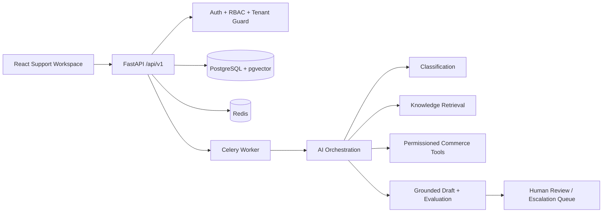

# ResolveIQ

ResolveIQ is a production-oriented demo of an AI customer support intelligence platform for the fictional company Northstar Commerce. It is designed as a portfolio project that demonstrates tenant isolation, RBAC, ticket workflows, RAG-style grounded drafts, controlled tools, escalation, evaluation, analytics, and AWS-ready deployment scaffolding.

Deployment status: this repository includes Docker and AWS infrastructure scaffolding, but it is not currently deployed to a live AWS account. The default AI provider is a deterministic mock so the app can run without API credentials. Live OpenAI usage is behind configuration.



## Implemented Vertical Slice

- FastAPI backend with typed schemas, versioned `/api/v1` routes, structured errors, correlation IDs, and health checks.
- SQLAlchemy models for tenants, users, tickets, customers, orders, messages, documents, chunks, drafts, citations, escalations, tool calls, evaluations, usage, audits, and settings.
- Demo authentication with Argon2 password hashing and JWT access tokens. Demo login is controlled by `DEMO_LOGIN_ENABLED` and must stay disabled in production.
- Tenant isolation enforced through authenticated membership and repository query filters.
- Ticket inbox, ticket detail, manual ingestion, webhook ingestion with idempotency, ticket actions, notes, approval/rejection/resolution, and escalation.
- Mock AI provider plus OpenAI provider adapter. Classification includes deterministic high-risk rules and fallback behavior.
- Knowledge ingestion from seeded policy docs, simple retrieval, grounded draft generation, citation validation, cost tracking, and escalation policy.
- Controlled tool registry for customer/order/subscription/refund approval workflows with schema validation and audit records.
- Evaluation dataset and CLI that writes actual report JSON from deterministic checks.
- React/Vite/Tailwind frontend with login, inbox, detail, knowledge, escalations, analytics, evaluation, user/admin, settings, audit, not-found, and access-denied pages.
- Ticket import from JSON/CSV, document ingestion from typed text or constrained text/Markdown/HTML uploads, document archive, settings updates, and audit inspection.
- Docker Compose for Postgres, Redis, API, worker, and frontend. AWS Terraform skeleton for ECS/RDS/ElastiCache/S3/CloudWatch architecture.
- CI workflow for backend and frontend checks.

## Quick Start

```bash
cp .env.example .env
docker compose up --build
```

Then open `http://localhost:5173`.

Demo users:

- `admin@northstar.demo` / `ResolveIQDemo!23`
- `manager@northstar.demo` / `ResolveIQDemo!23`
- `agent@northstar.demo` / `ResolveIQDemo!23`
- `analyst@northstar.demo` / `ResolveIQDemo!23`

Seed data is loaded with:

```bash
docker compose exec api python -m app.services.seed
```

Run backend tests:

```bash
cd apps/api
pytest
```

Current backend check result: `8 passed`.

Run the deterministic evaluation suite:

```bash
cd apps/api
python -m app.ai.evaluation.runner --dataset ../../evaluation/datasets/synthetic_support_cases.json --output ../../evaluation/reports/latest.json
```

Latest deterministic evaluation report: 105 synthetic cases, 85.7% classification accuracy, 85.7% escalation accuracy. These are actual local results, not claimed production metrics.

Build the frontend:

```bash
cd frontend
npm install
npm run build
```

Production dependency audit:

```bash
cd frontend
npm audit --omit=dev
```

Current result: `found 0 vulnerabilities`.

## AWS Deployment Readiness

ResolveIQ is structured for an AWS deployment path without provisioning paid resources automatically.

Live AWS infrastructure is intentionally not kept running from this repository because ECS, RDS, ElastiCache, NAT, and CloudWatch resources can create recurring cost. The repo is prepared so an operator can deploy the stack, run smoke tests, and tear it down when finished.

Target architecture:

- ECS Fargate services for the FastAPI API, Celery worker, and frontend.
- RDS PostgreSQL with pgvector for application data and vector retrieval.
- ElastiCache Redis for Celery broker/result backend and cache use cases.
- S3 for uploaded document storage in a production deployment.
- CloudWatch for logs, metrics, and operational alarms.
- AWS Secrets Manager or SSM Parameter Store for runtime secrets.

Included deployment assets:

- `docker-compose.yml` for local API, worker, frontend, Postgres/pgvector, and Redis.
- `infrastructure/docker/api.Dockerfile` and `infrastructure/docker/frontend.Dockerfile`.
- `infrastructure/aws/` Terraform scaffold.
- `.env.example` with safe local defaults.
- Alembic migration command wired into the API Docker startup path.

Not claimed:

- No live AWS endpoint is included in this repository.
- No AWS resources are provisioned automatically.
- No production traffic, customer deployment, uptime, SLA, or business-impact metrics are claimed.

If this project is deployed later, update this section with verifiable deployment evidence:

- Public app URL or internal load balancer URL.
- AWS region and high-level account/environment name.
- ECS service names and latest task revision.
- RDS engine/version and migration timestamp.
- CloudWatch log group names.
- Smoke-test timestamp and results.
- Terraform workspace/state location.

## Local Development Without Docker

```bash
cd apps/api
python -m venv .venv
source .venv/bin/activate
pip install -e ".[dev]"
uvicorn app.main:app --reload
```

```bash
cd frontend
npm install
npm run dev
```

## Current Limitations

- The default retrieval implementation uses deterministic token overlap for local demos. The data model and interfaces are pgvector-ready, but real vector search requires the PostgreSQL `vector` extension and embedding jobs.
- Document upload currently supports text, Markdown, and safely stripped HTML. PDF parsing is modeled in the roadmap but not implemented in this slice.
- Celery is configured and worker tasks are present, but the local vertical slice can process synchronously for easier demos.
- AWS files are deployment scaffolding only. They require explicit operator review before provisioning paid resources.
- Live OpenAI calls require `AI_PROVIDER=openai` and `OPENAI_API_KEY`; CI uses mocked responses.
- Full `npm audit` still reports dev-tooling advisories in Vite/Tailwind that require forced major upgrades. `npm audit --omit=dev` is clean.

See [architecture.md](/Users/pratham/Desktop/p/CSI_Platform/docs/architecture.md) and [implementation-plan.md](/Users/pratham/Desktop/p/CSI_Platform/docs/implementation-plan.md) for design details and milestones.
