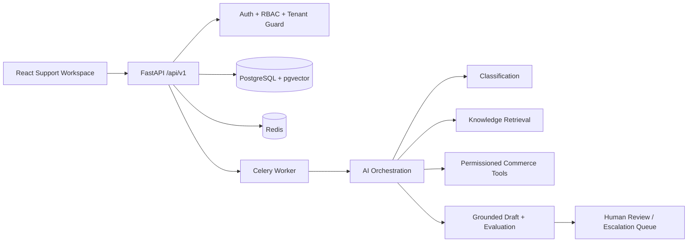

# ResolveIQ

ResolveIQ is a production-oriented demo of an AI customer support intelligence platform for the fictional company Northstar Commerce. It is designed as a portfolio/interview project that demonstrates tenant isolation, RBAC, ticket workflows, RAG-style grounded drafts, controlled tools, escalation, evaluation, analytics, and deployment scaffolding.

This repository is not deployed and should not be described as production-ready. The default AI provider is a deterministic mock so the app can run without API credentials. Live OpenAI usage is behind configuration.



## Implemented Vertical Slice

- FastAPI backend with typed schemas, versioned `/api/v1` routes, structured errors, correlation IDs, and health checks.
- SQLAlchemy models for tenants, users, tickets, customers, orders, messages, documents, chunks, drafts, citations, escalations, tool calls, evaluations, usage, audits, and settings.
- Demo authentication with Argon2 password hashing and JWT access tokens. Demo login is controlled by `DEMO_LOGIN_ENABLED` and must stay disabled in production.
- Tenant isolation enforced through authenticated membership and repository query filters.
- Ticket inbox, ticket detail, manual ingestion, webhook ingestion with idempotency, ticket actions, notes, approval/rejection/resolution, and escalation.
- Mock AI provider plus OpenAI provider adapter. Classification includes deterministic high-risk rules and fallback behavior.
- Knowledge ingestion from seeded policy docs, simple retrieval, grounded draft generation, citation validation, cost tracking, and escalation policy.
- Controlled tool registry for customer/order/subscription/refund approval workflows with schema validation and audit records.
- Evaluation dataset and CLI that writes actual report JSON from deterministic checks.
- React/Vite/Tailwind frontend with login, inbox, detail, knowledge, escalations, analytics, evaluation, user/admin, settings, audit, not-found, and access-denied pages.
- Docker Compose for Postgres, Redis, API, worker, and frontend. AWS Terraform skeleton for ECS/RDS/ElastiCache/S3/CloudWatch architecture.
- CI workflow for backend and frontend checks.

## Quick Start

```bash
cp .env.example .env
docker compose up --build
```

Then open `http://localhost:5173`.

Demo users:

- `admin@northstar.demo` / `ResolveIQDemo!23`
- `manager@northstar.demo` / `ResolveIQDemo!23`
- `agent@northstar.demo` / `ResolveIQDemo!23`
- `analyst@northstar.demo` / `ResolveIQDemo!23`

Seed data is loaded with:

```bash
docker compose exec api python -m app.services.seed
```

Run backend tests:

```bash
cd apps/api
pytest
```

Run the deterministic evaluation suite:

```bash
cd apps/api
python -m app.ai.evaluation.runner --dataset ../../evaluation/datasets/synthetic_support_cases.json --output ../../evaluation/reports/latest.json
```

## Local Development Without Docker

```bash
cd apps/api
python -m venv .venv
source .venv/bin/activate
pip install -e ".[dev]"
uvicorn app.main:app --reload
```

```bash
cd frontend
npm install
npm run dev
```

## Current Limitations

- The default retrieval implementation uses deterministic token overlap for local demos. The data model and interfaces are pgvector-ready, but real vector search requires the PostgreSQL `vector` extension and embedding jobs.
- Celery is configured and worker tasks are present, but the local vertical slice can process synchronously for easier demos.
- AWS files are deployment scaffolding only. They require explicit operator review before provisioning paid resources.
- Live OpenAI calls require `AI_PROVIDER=openai` and `OPENAI_API_KEY`; CI uses mocked responses.

See [architecture.md](/Users/pratham/Desktop/p/CSI_Platform/docs/architecture.md) and [implementation-plan.md](/Users/pratham/Desktop/p/CSI_Platform/docs/implementation-plan.md) for design details and milestones.
